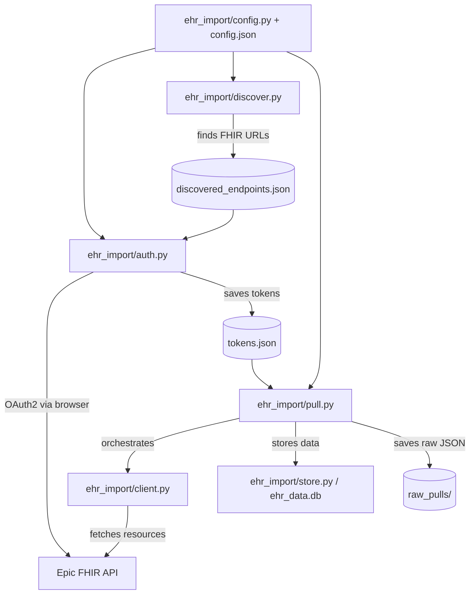

# Development Guide

## Architecture



## Project Structure

```
ehr_import/                  — Python package (core logic)
  __init__.py                — package init, version
  config.py                  — loads config.json + .env, resolves paths
  client.py                  — FHIRClient class: authenticated requests, pagination, attachments
  auth.py                    — OAuth2 flow: authorize, token exchange, PKCE, JWT, token storage
  store.py                   — Database class: schema, generic + convenience storage, dedup, warnings
  extract.py                 — field extraction engine: path resolution, special extractors
  resources.py               — RESOURCES list: what to pull and how to store it
  pull.py                    — orchestration: pull_for_patient, pull loop, raw archival
  discover.py                — endpoint discovery via Epic Brands Bundle

  tools/                     — Diagnostic/utility modules
    __init__.py
    probe.py                 — probe_subresources: identifies access restrictions per subresource
    compare.py               — compare_sources: record count comparison across EHI/FHIR sources
    ehi_import.py            — imports Epic EHI (Requested Record) TSV exports into SQLite

Top-level entry points (thin wrappers):
  auth.py                    → ehr_import.auth.main()
  pull.py                    → ehr_import.pull.main()
  discover.py                → ehr_import.discover.main()
  db.py                      → Database init / status check
  config.py                  → print_config()
  ehi_import.py              → tools.ehi_import.main()
  compare_sources.py         → tools.compare.main()
  probe_subresources.py      → tools.probe.main()

Other files:
  config.json                — public config: app client IDs, redirect URI, providers, active app
  jwks.json                  — public key (JWKS) for JWT auth — production
  jwks-nonprod.json          — public key (JWKS) for JWT auth — non-production
  setup/                     — setup_env.sh, generate_cert.py, generate_jwk.py, verify_setup.py
  docs/                      — SPEC.md, DEVELOPMENT.md, registration-guide.md, ehi-import.md
  assets/                    — app icon
```

## Data Flow

1. `python discover.py` finds FHIR URLs → saves to `discovered_endpoints.json`
2. `python auth.py "<provider>"` runs OAuth2 flow → saves tokens to `tokens.json`
3. `python pull.py "<provider>"` uses tokens to query FHIR → stores in `ehr_data.db` + `raw_pulls/`

## Key Design Decisions

- **Package structure** — core logic lives in `ehr_import/` package; top-level scripts are thin entry points (3-5 lines). Tools that don't depend on the FHIR pipeline live in `tools/`.
- **Config as module namespace** — `from ehr_import import config` then `config.db_path`, `config.providers`, etc. Module-level globals loaded once at import time. No class needed — Python modules are singletons.
- **FHIRClient class** — wraps base_url + token into a single object. Handles authenticated GET, pagination, and attachment fetching. Eliminates threading (base_url, token) through every function.
- **Database class** — context manager (`with Database() as db:`). Owns schema creation, generic + convenience storage, dedup, and warning handling.
- **Two-tier storage** — all FHIR resources go into a generic `resources` table (raw JSON + metadata); configured types also get materialized into convenience tables with curated columns. Adding a new resource type = one dict in `resources.py`.
- **Config-driven extraction** — `resources.py` declares column mappings using a path syntax (e.g., `"requester.display"`, `"@coding_display:code"`). No per-type store functions.
- **Hooks for special handling** — `dedup` (case-insensitive allergy dedup), `content_fetch` (chase Binary URLs for notes/reports), `effective_date` (priority list of date fields)
- **`reinterpreted` flag** — resources that have a convenience table are marked `reinterpreted=1` in the generic table, so exploratory queries on `resources` can skip them
- **Configurable data directory** — private data lives outside the repo (default sibling dir)
- **Per-provider tokens** — each provider gets its own token record; supports multiple EHRs
- **Multi-patient token store** — tokens keyed by `provider:patient_id`; re-auth for a different patient accumulates (doesn't overwrite); `pull.py` pulls all patients by default
- **Multi-patient support** — `patient_id` column on all data tables; supports pulling records for family members via proxy access
- **OperationOutcome filtering** — Epic sometimes includes OperationOutcome resources in Bundle entries; these are separated into warnings before storage
- **HTTPS callback with retry loop** — Epic requires secure redirect URIs; the callback server loops to survive browser cert warnings and preflight requests on first use
- **Per-provider redirect URI** — some providers behind the CHPPOC network have web application firewall (WAF) rules that block `localhost` in query strings; these use `lvh.me` (resolves to 127.0.0.1) as the redirect host instead. This is safe because PKCE protects the flow: even if `lvh.me` DNS were hijacked, the intercepted authorization code is useless without the `code_verifier` that never leaves your machine.
- **Dual auth support** — public client (PKCE, no secrets) for open-source distribution; confidential client (JWT assertion) for personal use with refresh tokens
- **Proactive token refresh** — `pull_for_patient` refreshes the access token before starting (if a refresh token exists). Eliminates mid-pull expiry failures at the cost of one extra round-trip per patient.
- **Raw JSON preservation** — every pull saves raw FHIR responses alongside structured DB storage; includes full OperationOutcome issue objects per resource type
- **Unfiltered warning capture** — all OperationOutcome issues are stored in `pull_warnings` with full JSON, severity, code, text, and diagnostics. No pre-filtering — this is a forensic log for diagnosing access restrictions.
- **Content fetch tracking** — notes and diagnostic reports track fetch status (`ok`, `fetch_failed`, `empty`, `no_attachment`) with the resolved URL, enabling automated retry of failed fetches

## Authentication Methods

The app supports three OAuth2 authentication methods. Which methods are available is
determined by the `auth_methods` array in each app's config within `config.json`.

During token exchange, the app tries each configured method in order until one succeeds.

### Configuration

```json
{
    "active_app": "confidential",
    "apps": {
        "public": {
            "client_id": "...",
            "auth_methods": ["public"]
        },
        "confidential": {
            "client_id": "...",
            "non_production_client_id": "...",
            "auth_methods": ["jwt", "secret"]
        }
    }
}
```

Each method is only attempted if the required credentials are present:
- `"public"` — always available (PKCE needs no credentials)
- `"secret"` — requires `DATA_DIR/client_secret.txt`
- `"jwt"` — requires `DATA_DIR/jwk_private.pem`

The successful method is stored in `tokens.json` so that token refresh uses the same method.

### Public Client (default for open-source use)

- No client secret or key pair needed — just the client ID
- Uses PKCE (S256 code challenge) for security
- Anyone can clone the repo and use it immediately
- **Tradeoff:** No refresh tokens. Access tokens expire (~1 hour), requiring re-login.
  Acceptable for a "download my data" tool that runs occasionally.
- Token exchange sends: `client_id` + `code` + `redirect_uri` + `code_verifier`

### Confidential Client (advanced use)

- Requires a registered app with the "confidential client" profile enabled
- Authenticates to the token endpoint using a signed JWT (`private_key_jwt`)
- **Enables refresh tokens** — access persists across sessions without re-login
- Token exchange sends: `client_id` + `code` + `redirect_uri` + `client_assertion`

#### JWT Assertion Flow (private_key_jwt)

Instead of a client secret, the app signs a short-lived JWT with an RSA private key.
Epic verifies it against the public key hosted at the app's registered JWK Set URL.

1. Generate an RSA key pair (one-time setup via `setup/generate_jwk.py`)
2. Host the public key as a JWKS file (e.g., raw GitHub URL or any HTTPS endpoint)
3. Register the JWK Set URL on open.epic.com
4. At token exchange, the app builds a JWT with:
   - `iss`: client ID
   - `sub`: client ID
   - `aud`: token endpoint URL
   - `jti`: unique UUID
   - `exp`: current time + 5 minutes
5. Signs it with RS384 and sends as `client_assertion`

The private key lives in `DATA_DIR/jwk_private.pem` (gitignored).
The public JWKS lives in the public repo at `jwks.json`.

#### Why JWK Set URL over Client Secret

- Epic hashes client secrets — you can't retrieve them after generation
- Secrets are per-organization (each org download needs its own secret)
- JWK Set URL is set once at the app level and works for all organizations
- Epic recommends JWK Set URL and is deprecating other methods for backend apps

### Why Two Client Types?

Epic's model requires each developer to register their own app. For an open-source tool
whose purpose is helping patients access their own data, this creates unacceptable friction.

The public client path eliminates all credential management — users just need the shared
client ID (published in the repo). The confidential path exists for developers who want
refresh tokens and are willing to register their own app.

### Production Distribution (Confidential Client)

After marking an app "Ready for Production" on open.epic.com:
1. Epic organizations request to download the app (happens automatically for qualifying apps)
2. The developer must activate each download via "Review & Manage Downloads"
3. Non-production must be activated before production
4. With JWK Set URL auth, select "JWK Set URL (Recommended)" — it uses the app-level URL
5. Leave "Use App-level Endpoint URIs" checked unless redirect URIs vary per org (our single localhost redirect works fine at app level)
6. There may be a sync delay (up to 1 business day) before the org recognizes the client ID

## Access Restrictions (OperationOutcome Codes)

Epic returns OperationOutcome issues alongside FHIR results to signal incomplete data.
These are captured in the `pull_warnings` table for forensic analysis.

### Warning Codes

Epic returns multiple `issue` entries within a single OperationOutcome response. The codes
work together:

- **4119 is a generic summary flag** — it accompanies one or more specific 59204/59205
  entries. It means "this response is incomplete" but doesn't say why on its own. The
  specific 59204/59205 sibling issues name exactly which sub-resource was withheld.
- On the USCDI v3 app with full endpoint registration, every 4119 has an accompanying
  59204 or 59205 that explains it. No standalone unexplained 4119s have been observed.

| Code | Level | Meaning |
|------|-------|---------|
| 4119 | Generic | "May not contain the entire record." Summary flag — always paired with a specific 59204 or 59205 that names the withheld sub-resource. |
| 59204 | App-level | "Client not authorized for [Resource] - [Sub-resource]." The **app registration** is missing a specific API endpoint. Affects all users equally regardless of login. Fix: register a new app with the missing endpoints (production-locked apps cannot be modified). |
| 59205 | User-level | "User not authorized for [Resource] - [Sub-resource]." The **authenticated user** lacks permission to view that sub-resource. Observed on proxy/guardian logins (blocked from "Outside Record" data) and on sandbox test users (blocked from specialty sub-resources like Genomics, SmartData Elements). Nothing the app developer can do. |
| 4101 | Informational | "Resource request returns no results." Normal — the patient simply has no data of that type. |
| 59100 | Informational | "Content invalid against the specification." Usually a parameter warning (e.g., unknown param ignored). |

### Observed Patterns (BCH, May 2026)

**User-level (59205) — proxy vs direct login:**
- Proxy blocked from: AllergyIntolerance, MedicationRequest, Immunization, MedicationDispense, Procedure, Goal — all "Outside Record" sub-resources
- Direct login: no 59205 errors; gets full data including received/external records
- Impact: Medications 15→131, Immunizations 6→74, MedicationDispense 0→77, Procedures 0→27, Allergies 2→6

**App-level (59204) — affects both logins equally:**
- Named denials on production (Tufts): Condition (Genomics, Dental Finding, Infection, Medical History, Reason For Visit)
- These are non-USCDI sub-resources not included in the USCDI v3 automatic distribution

### Remaining Gaps (USCDI v3 App)

The USCDI v3 app (`f2a91bd8`) is missing some non-USCDI sub-resources. On production
(Tufts), these appear as 59204 denials for Condition (Genomics, Dental Finding, Infection,
Medical History, Reason For Visit). These are unlikely to contain data for most patients.

The apparent gaps in record counts between EHI export and FHIR pull are mostly data model
differences, not access restrictions:

**DocumentReference (13 via FHIR vs 228 in EHI):** The EHI's `HNO_INFO` table contains all
note types. FHIR returns only sub-resources the app is authorized for. The USCDI v3 app
has Clinical Notes but is missing some non-USCDI DocumentReference sub-resources (Document
Information, External CDAs, Clinical References, Radiology Results, Correspondences, etc.).

**DiagnosticReport (28 vs 92 in EHI):** Comparison artifact — EHI's `ORDER_PROC` includes
lab orders (75/92) which map to Observation in FHIR, not DiagnosticReport. Excluding labs,
FHIR actually returns more (includes outside record results).

**Encounter (15 vs 80 in EHI):** Data model difference — EHI's `PAT_ENC` includes cancelled
appointments, phone encounters, and message threads. FHIR Encounter only exposes completed
clinical encounters.

**Vitals (52 vs 93 in EHI):** Data model difference — EHI's `IP_FLWSHT_MEAS` includes
screening questions, questionnaire responses, and calculated fields. FHIR
`Observation?category=vital-signs` returns only actual vitals.

## Adding a New Resource Type

Add one dict to `ehr_import/resources.py`:

```python
{
    "fhir_type": "FHIRResourceType",
    "label": "Human-readable label",
    "search_params": {},
    "table": "convenience_table_name",
    "columns": {
        "col_name": "path.to.field | fallback.path",
    },
    "effective_date": ["dateField1", "dateField2"],
}
```

Then run `python db.py` to create the new table, and `python pull.py` to populate it.

## Adding a New Provider

1. Add entry to `config.json` under `providers` with `portal_url` or `hint`
2. Run `python discover.py` to find its FHIR endpoints
3. Run `python auth.py "<new provider>"` to authenticate

## Database Schema

See `ehr_import/store.py` and `ehr_import/resources.py` for full schema. Two-tier design:

### Generic table
- `resources` — every FHIR resource (fhir_id, resource_type, label, patient_id, provider, effective_date, reinterpreted, raw_json)

### Convenience tables (auto-created from resources.py)
- `labs` — lab results (code, value, unit, reference_range, status)
- `vitals` — vital signs (code, value, unit, status)
- `notes` — clinical notes (doc_type, author, date, status, content_text + fetch tracking)
- `diagnostic_reports` — imaging/pathology/lab panels (code, status, content_text + fetch tracking)
- `conditions` — diagnoses and problems (code, clinical/verification status, category, onset/abatement)
- `allergies` — allergy/intolerance (code, status, type, category, criticality, reactions) — case-deduped
- `encounters` — visits (type, status, class, dates, reason, participant)
- `medications` — medication requests (name, status, intent, reported, dosage, requester)
- `social_history` — social history observations (code, value, status)
- `assessments` — survey/questionnaire results (code, value, status)
- `immunizations` — vaccinations (vaccine_name, status, occurrence_date, site, performer)
- `medication_dispenses` — pharmacy dispensing (name, status, quantity, days_supply, when_handed_over)
- `procedures` — procedures (code, status, performed_date, performer, reason)
- `care_plans` — care plans (title, status, intent, category, dates)
- `goals` — patient goals (description, lifecycle_status, dates)

### Operational tables
- `patients` — demographics (name, DOB, provider)
- `pull_warnings` — append-only log of all OperationOutcome issues
- `data_status` — current completeness state per provider/patient/resource_type
- `sync_log` — tracks pull history

All convenience tables include `patient_id`, `provider`, `effective_date`, `raw_json`, and `UNIQUE(fhir_id, patient_id)`.

## Testing Against Epic Sandbox

```bash
python auth.py "Epic Sandbox"
python pull.py "Epic Sandbox"
```

Epic Sandbox is configured as a provider with `"non_production": true` in config.json,
so it automatically uses the non-production client ID. Sandbox test credentials: `fhircamila` / `epicepic1`.

## Dependencies

- `requests` — HTTP client for FHIR API calls
- `python-dotenv` — .env file loading
- `PyJWT` — JWT signing for confidential client auth
- `cryptography` — self-signed cert generation, RSA key handling

## App Registration

The included public client ID works for anyone — no registration needed.

If you want refresh tokens (confidential client) or want to register your own app
(e.g., forking this project), see [registration-guide.md](registration-guide.md).

## Acknowledgments

Lab/report deduplication logic informed by
[Fetch My Epic Token](https://github.com/glmck13/FetchMyEpicToken) by glmck13 —
a handy tool for extracting EHR data via Epic's FHIR API. Thanks for the prior art.

App icon from [Health Icons](https://healthicons.org/) — a free, open source icon set
for public health projects (CC0 license).
