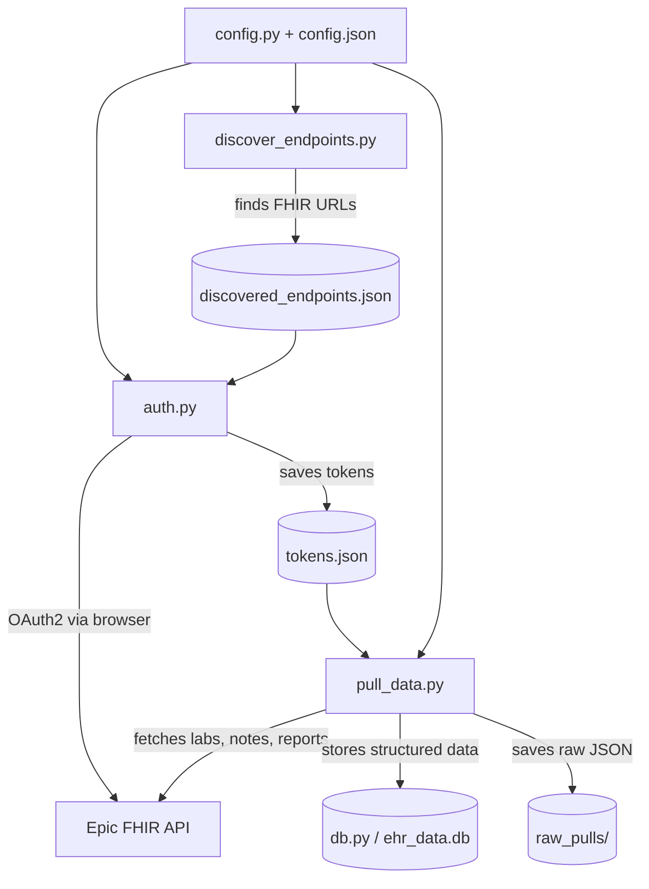

# Development Guide

## Architecture



## File Responsibilities

| File | Role |
|------|------|
| `config.py` | Central config: loads `config.json` + `.env`, resolves all paths |
| `config.json` | Public config: client IDs, redirect URI, provider list |
| `auth.py` | OAuth2 authorization code flow with HTTPS callback server |
| `pull_data.py` | FHIR data fetching, deduplication, storage |
| `db.py` | SQLite schema, connection management |
| `discover_endpoints.py` | Probes MyChart URLs to find FHIR base/auth/token endpoints |

## Data Flow

1. `discover_endpoints.py` finds FHIR URLs → saves to `discovered_endpoints.json`
2. `auth.py` runs OAuth2 flow → saves tokens to `tokens.json`
3. `pull_data.py` uses tokens to query FHIR → stores in `ehr_data.db` + `raw_pulls/`

## Key Design Decisions

- **Configurable data directory** — private data lives outside the repo (default sibling dir)
- **Per-provider tokens** — each provider gets its own token record; supports multiple EHRs
- **Multi-patient support** — `patient_id` column on all data tables; supports pulling records for family members via proxy access
- **Lab/report deduplication** — cross-references DiagnosticReport results against Observations to avoid double-counting (pattern from FetchMyEpicToken)
- **OperationOutcome filtering** — Epic sometimes includes OperationOutcome resources in Bundle entries (e.g., parameter warnings); these are filtered out before storage
- **HTTPS callback with retry loop** — Epic requires secure redirect URIs; the callback server loops to survive browser cert warnings and preflight requests on first use
- **Confidential client** — enables refresh tokens for ongoing access without re-auth
- **Raw JSON preservation** — every pull saves raw FHIR responses alongside structured DB storage
- **Content fetch tracking** — notes and diagnostic reports track fetch status (`ok`, `fetch_failed`, `empty`, `no_attachment`) with the resolved URL, enabling automated retry of failed fetches

## Adding a New Provider

1. Add entry to `config.json` under `providers` with `mychart_base` URL
2. Run `python discover_endpoints.py` to find its FHIR endpoints
3. Run `python auth.py "<new provider>"` to authenticate

## Database Schema

See `db.py` for full schema. Tables:
- `labs` — structured lab results (patient_id, code, value, unit, reference range, date)
- `notes` — clinical notes (patient_id, type, author, date, full text content, fetch status/URL)
- `diagnostic_reports` — imaging/pathology/lab panels (patient_id, code, date, presentedForm content, result observation refs, fetch status/URL)
- `sync_log` — tracks pull history per provider

All data tables include `patient_id` (FHIR patient ID from the token response) to support multiple family members from the same provider. Unique constraint is `(fhir_id, patient_id)`.

Content fetch tracking columns (`content_fetch_status`, `content_fetch_detail`, `content_fetch_url`) on `notes` and `diagnostic_reports` enable querying for failed fetches and retrying them with a fresh token.

## Testing Against Epic Sandbox

```bash
USE_SANDBOX=true python auth.py "Epic Sandbox"
USE_SANDBOX=true python pull_data.py "Epic Sandbox"
```

Uses the non-production client ID. Sandbox test credentials: `fhircamila` / `epicepic1`.

Note: The sandbox does not serve Binary resource content (returns 403), so clinical
notes and diagnostic report attachments will show `content_fetch_status = 'fetch_failed'`.
This is expected — production endpoints serve the actual content.

## Dependencies

- `requests` — HTTP client for FHIR API calls
- `python-dotenv` — .env file loading
- `httpx` — async HTTP (for future parallel fetching)
- `cryptography` — self-signed cert generation

## App Registration

The included client ID works for anyone. If you want to register your own app
(e.g., forking this project), see [registration-guide.md](registration-guide.md).

## Acknowledgments

Lab/report deduplication logic informed by
[Fetch My Epic Token](https://github.com/glmck13/FetchMyEpicToken) by glmck13 —
a handy tool for extracting EHR data via Epic's FHIR API. Thanks for the prior art.

App icon from [Health Icons](https://healthicons.org/) — a free, open source icon set
for public health projects (CC0 license).
