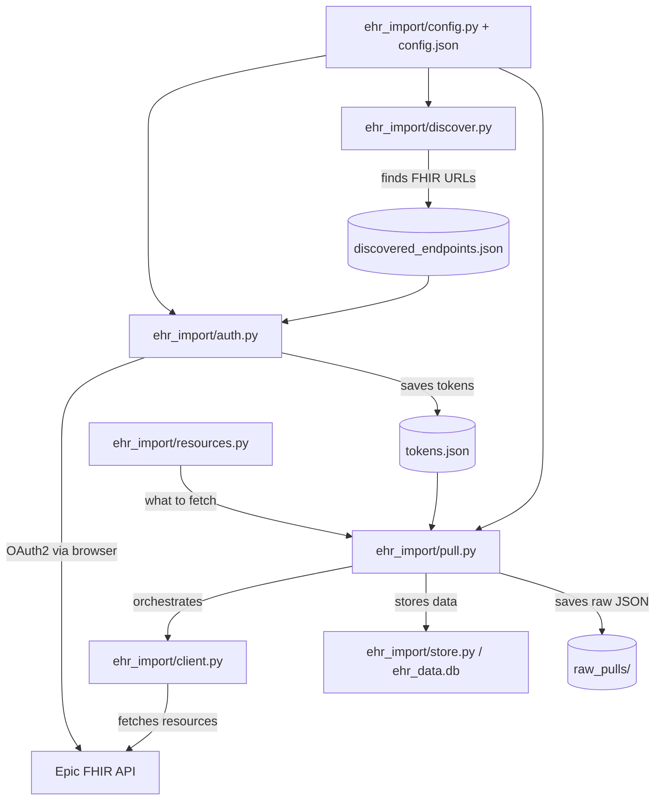

# Development Guide

## Architecture



## Project Structure

```
ehr_import/                  — Python package (core logic)
  __init__.py                — package init, version
  config.py                  — loads config.json + .env, resolves paths
  client.py                  — FHIRClient class: authenticated requests, pagination, attachments
  auth.py                    — OAuth2 flow: authorize, token exchange, PKCE, JWT, token storage
  store.py                   — Database class: schema, generic + convenience storage, dedup, warnings
  extract.py                 — field extraction engine: path resolution, special extractors
  resources.py               — RESOURCES list: what to pull and how to store it
  pull.py                    — orchestration: pull_for_patient, pull loop, raw archival
  discover.py                — endpoint discovery via Epic Brands Bundle

  tools/                     — Diagnostic/utility modules
    __init__.py
    probe.py                 — probe_subresources: identifies access restrictions per subresource
    compare.py               — compare_sources: record count comparison across EHI/FHIR sources
    ehi_import.py            — imports Epic EHI (Requested Record) TSV exports into SQLite
    ccda_import.py           — imports C-CDA R2.1 XML into unified ehr_data.db (multi-source)

Top-level entry points (thin wrappers):
  auth.py                    → ehr_import.auth.main()
  pull.py                    → ehr_import.pull.main()
  discover.py                → ehr_import.discover.main()
  db.py                      → Database init / status check
  config.py                  → print_config()
  ehi_import.py              → tools.ehi_import.main()
  ccda_import.py             → tools.ccda_import.build_database()
  compare_sources.py         → tools.compare.main()
  probe_subresources.py      → tools.probe.main()
  migrate_db.py              → schema migrations (v0 → v1: source column, content_html, treatment_plans)

Other files:
  config.json                — public config: app client IDs, redirect URI, providers, active app
  jwks.json                  — public key (JWKS) for JWT auth — production
  jwks-nonprod.json          — public key (JWKS) for JWT auth — non-production
  setup/                     — setup_env.sh, generate_cert.py, generate_jwk.py, verify_setup.py
  docs/                      — SPEC.md, DEVELOPMENT.md, unified-db-spec.md, registration-guide.md, ehi-import.md, authentication.md, access-restrictions.md, eclinicalworks-integration.md
  assets/                    — app icon
```

## Data Flow

1. `python discover.py` finds FHIR URLs → saves to `discovered_endpoints.json`
2. `python auth.py "<provider>"` runs OAuth2 flow → saves tokens to `tokens.json`
3. `python pull.py "<provider>"` uses tokens to query FHIR → stores in `ehr_data.db` + `raw_pulls/`

## Key Design Decisions

- **Package structure** — core logic lives in `ehr_import/` package; top-level scripts are thin entry points (3-5 lines). Tools that don't depend on the FHIR pipeline live in `tools/`.
- **Config as module namespace** — `from ehr_import import config` then `config.db_path`, `config.providers`, etc. Module-level globals loaded once at import time. No class needed — Python modules are singletons.
- **FHIRClient class** — wraps base_url + token into a single object. Handles authenticated GET, pagination, and attachment fetching. Eliminates threading (base_url, token) through every function.
- **Database class** — context manager (`with Database() as db:`). Owns schema creation, generic + convenience storage, dedup, and warning handling.
- **Two-tier storage** — all FHIR resources go into a generic `resources` table (raw JSON + metadata); configured types also get materialized into convenience tables with curated columns. Adding a new resource type = one dict in `resources.py`.
- **Config-driven extraction** — `resources.py` declares column mappings using a path syntax (e.g., `"requester.display"`, `"@coding_display:code"`). No per-type store functions.
- **Hooks for special handling** — `dedup` (case-insensitive allergy dedup), `content_fetch` (chase Binary URLs for notes/reports), `effective_date` (priority list of date fields)
- **`reinterpreted` flag** — resources that have a convenience table are marked `reinterpreted=1` in the generic table, so exploratory queries on `resources` can skip them
- **Configurable data directory** — private data lives outside the repo (default sibling dir)
- **Per-provider tokens** — each provider gets its own token record; supports multiple EHRs
- **Multi-patient token store** — tokens keyed by `provider:patient_id`; re-auth for a different patient accumulates (doesn't overwrite); `pull.py` pulls all patients by default
- **Multi-patient support** — `patient_id` column on all data tables; supports pulling records for family members via proxy access
- **OperationOutcome filtering** — Epic sometimes includes OperationOutcome resources in Bundle entries; these are separated into warnings before storage
- **HTTPS callback with retry loop** — Epic requires secure redirect URIs; the callback server loops to survive browser cert warnings and preflight requests on first use
- **Per-provider redirect URI** — some providers behind the CHPPOC network have web application firewall (WAF) rules that block `localhost` in query strings; these use `lvh.me` (resolves to 127.0.0.1) as the redirect host instead. This is safe because PKCE protects the flow: even if `lvh.me` DNS were hijacked, the intercepted authorization code is useless without the `code_verifier` that never leaves your machine.
- **Dual auth support** — public client (PKCE, no secrets) for open-source distribution; confidential client (JWT assertion) for personal use with refresh tokens
- **Proactive token refresh** — `pull_for_patient` refreshes the access token before starting (if a refresh token exists). Eliminates mid-pull expiry failures at the cost of one extra round-trip per patient.
- **Raw JSON preservation** — every pull saves raw FHIR responses alongside structured DB storage; includes full OperationOutcome issue objects per resource type
- **Unfiltered warning capture** — all OperationOutcome issues are stored in `pull_warnings` with full JSON, severity, code, text, and diagnostics. No pre-filtering — this is a forensic log for diagnosing access restrictions.
- **Content fetch tracking** — notes and diagnostic reports track fetch status (`ok`, `fetch_failed`, `empty`, `no_attachment`) with the resolved URL, enabling automated retry of failed fetches

## Authentication Methods

Three OAuth2 methods: public (PKCE), confidential (JWT assertion), and client secret.
The active app and its allowed methods are configured in `config.json`. See
[authentication.md](authentication.md) for the full details — config format, flow
mechanics, JWT setup, production distribution steps, and the rationale for dual client
types.

## Access Restrictions

Epic returns OperationOutcome issues to signal incomplete data. These are captured in
`pull_warnings` for forensic analysis. See [access-restrictions.md](access-restrictions.md)
for the full breakdown of warning codes, observed patterns, known limitations, and the
FHIR vs EHI comparison.

## Adding a New Resource Type

Add one dict to `ehr_import/resources.py`:

```python
{
    "fhir_type": "FHIRResourceType",
    "label": "Human-readable label",
    "search_params": {},
    "table": "convenience_table_name",
    "columns": {
        "col_name": "path.to.field | fallback.path",
    },
    "effective_date": ["dateField1", "dateField2"],
}
```

Then run `python db.py` to create the new table, and `python pull.py` to populate it.

## Adding a New Provider

See [setup/README.md — Adding Your Providers](../setup/README.md#adding-your-providers)
for the config format and discovery options.

## Database Schema

See `ehr_import/store.py` and `ehr_import/resources.py` for full schema. Two-tier design:

### Generic table
- `resources` — every FHIR resource (fhir_id, resource_type, label, patient_id, provider, effective_date, reinterpreted, raw_json)

### Convenience tables (auto-created from resources.py)
- `labs` — lab results (code, value, unit, reference_range, status)
- `vitals` — vital signs (code, value, unit, status)
- `notes` — clinical notes (doc_type, author, date, status, content_text + fetch tracking)
- `diagnostic_reports` — imaging/pathology/lab panels (code, status, content_text + fetch tracking)
- `conditions` — diagnoses and problems (code, clinical/verification status, category, onset/abatement)
- `allergies` — allergy/intolerance (code, status, type, category, criticality, reactions) — case-deduped
- `encounters` — visits (type, status, class, dates, reason, participant)
- `medications` — medication requests (name, status, intent, reported, dosage, requester)
- `social_history` — social history observations (code, value, status)
- `assessments` — survey/questionnaire results (code, value, status)
- `immunizations` — vaccinations (vaccine_name, status, occurrence_date, site, performer)
- `medication_dispenses` — pharmacy dispensing (name, status, quantity, days_supply, when_handed_over)
- `procedures` — procedures (code, status, performed_date, performer, reason)
- `care_plans` — care plans (title, status, intent, category, dates)
- `goals` — patient goals (description, lifecycle_status, dates)

### Operational tables
- `patients` — demographics (name, DOB, provider)
- `pull_warnings` — append-only log of all OperationOutcome issues
- `data_status` — current completeness state per provider/patient/resource_type
- `sync_log` — tracks pull history

All convenience tables include `patient_id`, `provider`, `effective_date`, `raw_json`, and `UNIQUE(fhir_id, patient_id)`.

## Testing Against Epic Sandbox

```bash
python auth.py "Epic Sandbox"
python pull.py "Epic Sandbox"
```

Epic Sandbox is configured as a provider with `"non_production": true` in config.json,
so it automatically uses the non-production client ID. Sandbox test credentials: `fhircamila` / `epicepic1`.

## Dependencies

- `requests` — HTTP client for FHIR API calls
- `python-dotenv` — .env file loading
- `PyJWT` — JWT signing for confidential client auth
- `cryptography` — self-signed cert generation, RSA key handling

## App Registration

The included public client ID works for anyone — no registration needed.

If you want refresh tokens (confidential client) or want to register your own app
(e.g., forking this project), see [registration-guide.md](registration-guide.md).

## Acknowledgments

Lab/report deduplication logic informed by
[Fetch My Epic Token](https://github.com/glmck13/FetchMyEpicToken) by glmck13 —
a handy tool for extracting EHR data via Epic's FHIR API. Thanks for the prior art.

App icon from [Health Icons](https://healthicons.org/) — a free, open source icon set
for public health projects (CC0 license).
