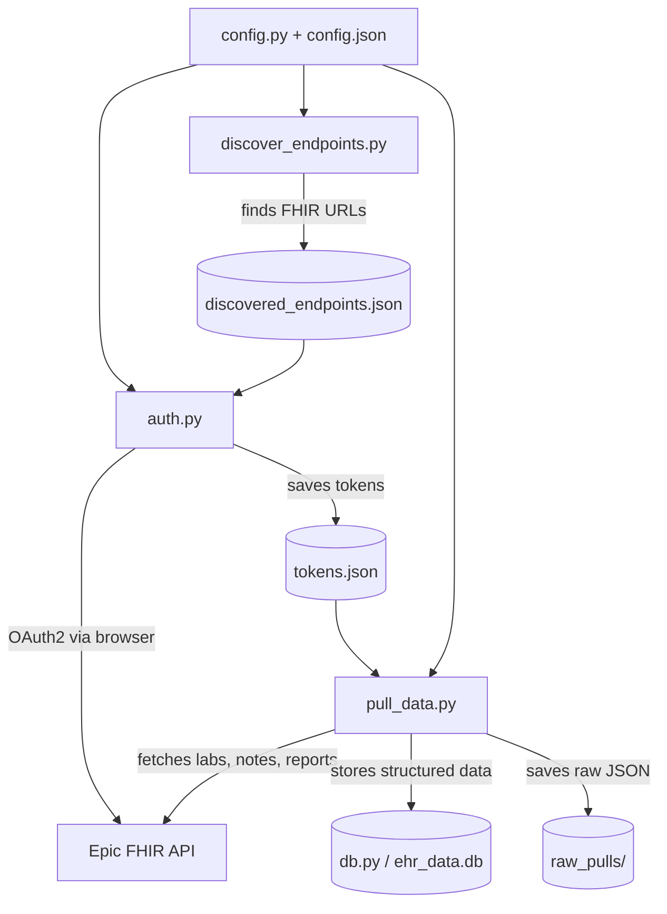

# Development Guide

## Architecture



## File Responsibilities

| File | Role |
|------|------|
| `config.py` | Central config: loads `config.json` + `.env`, resolves all paths |
| `config.json` | Public config: app client IDs, redirect URI, provider list, active app selector |
| `auth.py` | OAuth2 authorization code flow (public/secret/JWT), HTTPS callback server |
| `pull_data.py` | FHIR data fetching, deduplication, storage |
| `db.py` | SQLite schema, connection management |
| `discover_endpoints.py` | Probes MyChart URLs to find FHIR base/auth/token endpoints |
| `jwks.json` | Public key (JWKS) for JWT auth — production |
| `jwks-nonprod.json` | Public key (JWKS) for JWT auth — non-production |
| `setup/generate_jwk.py` | Generates RSA key pair for JWT auth |
| `setup/generate_cert.py` | Generates self-signed cert for HTTPS callback |
| `setup/setup_env.sh` | Conda environment setup |
| `setup/verify_setup.py` | Validates configuration and dependencies |

## Data Flow

1. `discover_endpoints.py` finds FHIR URLs → saves to `discovered_endpoints.json`
2. `auth.py` runs OAuth2 flow → saves tokens to `tokens.json`
3. `pull_data.py` uses tokens to query FHIR → stores in `ehr_data.db` + `raw_pulls/`

## Key Design Decisions

- **Configurable data directory** — private data lives outside the repo (default sibling dir)
- **Per-provider tokens** — each provider gets its own token record; supports multiple EHRs
- **Multi-patient token store** — tokens keyed by `provider:patient_id`; re-auth for a different patient accumulates (doesn't overwrite); `pull_data.py` pulls all patients by default
- **Multi-patient support** — `patient_id` column on all data tables; supports pulling records for family members via proxy access
- **Lab/report deduplication** — cross-references DiagnosticReport results against Observations to avoid double-counting (pattern from FetchMyEpicToken)
- **OperationOutcome filtering** — Epic sometimes includes OperationOutcome resources in Bundle entries (e.g., parameter warnings); these are filtered out before storage
- **HTTPS callback with retry loop** — Epic requires secure redirect URIs; the callback server loops to survive browser cert warnings and preflight requests on first use
- **Per-provider redirect URI** — some providers behind the CHPPOC network have web application firewall (WAF) rules that block `localhost` in query strings; these use `lvh.me` (resolves to 127.0.0.1) as the redirect host instead. This is safe because PKCE protects the flow: even if `lvh.me` DNS were hijacked, the intercepted authorization code is useless without the `code_verifier` that never leaves your machine.
- **Dual auth support** — public client (PKCE, no secrets) for open-source distribution; confidential client (JWT assertion) for personal use with refresh tokens
- **Raw JSON preservation** — every pull saves raw FHIR responses alongside structured DB storage
- **Content fetch tracking** — notes and diagnostic reports track fetch status (`ok`, `fetch_failed`, `empty`, `no_attachment`) with the resolved URL, enabling automated retry of failed fetches

## Authentication Methods

The app supports three OAuth2 authentication methods. Which methods are available is
determined by the `auth_methods` array in each app's config within `config.json`.

During token exchange, the app tries each configured method in order until one succeeds.

### Configuration

```json
{
    "active_app": "public",
    "apps": {
        "public": {
            "client_id": "...",
            "auth_methods": ["public"]
        },
        "confidential": {
            "client_id": "...",
            "auth_methods": ["jwt", "secret"]
        }
    }
}
```

Each method is only attempted if the required credentials are present:
- `"public"` — always available (PKCE needs no credentials)
- `"secret"` — requires `DATA_DIR/client_secret.txt`
- `"jwt"` — requires `DATA_DIR/jwk_private.pem`

The successful method is stored in `tokens.json` so that token refresh uses the same method.

### Public Client (default for open-source use)

- No client secret or key pair needed — just the client ID
- Uses PKCE (S256 code challenge) for security
- Anyone can clone the repo and use it immediately
- **Tradeoff:** No refresh tokens. Access tokens expire (~1 hour), requiring re-login.
  Acceptable for a "download my data" tool that runs occasionally.
- Token exchange sends: `client_id` + `code` + `redirect_uri` + `code_verifier`

### Confidential Client (advanced use)

- Requires a registered app with the "confidential client" profile enabled
- Authenticates to the token endpoint using a signed JWT (`private_key_jwt`)
- **Enables refresh tokens** — access persists across sessions without re-login
- Token exchange sends: `client_id` + `code` + `redirect_uri` + `client_assertion`

#### JWT Assertion Flow (private_key_jwt)

Instead of a client secret, the app signs a short-lived JWT with an RSA private key.
Epic verifies it against the public key hosted at the app's registered JWK Set URL.

1. Generate an RSA key pair (one-time setup via `setup/generate_jwk.py`)
2. Host the public key as a JWKS file (e.g., raw GitHub URL or any HTTPS endpoint)
3. Register the JWK Set URL on open.epic.com
4. At token exchange, the app builds a JWT with:
   - `iss`: client ID
   - `sub`: client ID
   - `aud`: token endpoint URL
   - `jti`: unique UUID
   - `exp`: current time + 5 minutes
5. Signs it with RS384 and sends as `client_assertion`

The private key lives in `DATA_DIR/jwk_private.pem` (gitignored).
The public JWKS lives in the public repo at `jwks.json`.

#### Why JWK Set URL over Client Secret

- Epic hashes client secrets — you can't retrieve them after generation
- Secrets are per-organization (each org download needs its own secret)
- JWK Set URL is set once at the app level and works for all organizations
- Epic recommends JWK Set URL and is deprecating other methods for backend apps

### Why Two Client Types?

Epic's model requires each developer to register their own app. For an open-source tool
whose purpose is helping patients access their own data, this creates unacceptable friction.

The public client path eliminates all credential management — users just need the shared
client ID (published in the repo). The confidential path exists for developers who want
refresh tokens and are willing to register their own app.

### Production Distribution (Confidential Client)

After marking an app "Ready for Production" on open.epic.com:
1. Epic organizations request to download the app (happens automatically for qualifying apps)
2. The developer must activate each download via "Review & Manage Downloads"
3. Non-production must be activated before production
4. With JWK Set URL auth, select "JWK Set URL (Recommended)" — it uses the app-level URL
5. Leave "Use App-level Endpoint URIs" checked unless redirect URIs vary per org (our single localhost redirect works fine at app level)
6. There may be a sync delay (up to 1 business day) before the org recognizes the client ID

## Adding a New Provider

1. Add entry to `config.json` under `providers` with `mychart_base` URL
2. Run `python discover_endpoints.py` to find its FHIR endpoints
3. Run `python auth.py "<new provider>"` to authenticate

## Database Schema

See `db.py` for full schema. Tables:
- `labs` — structured lab results (patient_id, code, value, unit, reference range, date)
- `notes` — clinical notes (patient_id, type, author, date, full text content, fetch status/URL)
- `diagnostic_reports` — imaging/pathology/lab panels (patient_id, code, date, presentedForm content, result observation refs, fetch status/URL)
- `sync_log` — tracks pull history per provider

All data tables include `patient_id` (FHIR patient ID from the token response) to support multiple family members from the same provider. Unique constraint is `(fhir_id, patient_id)`.

Content fetch tracking columns (`content_fetch_status`, `content_fetch_detail`, `content_fetch_url`) on `notes` and `diagnostic_reports` enable querying for failed fetches and retrying them with a fresh token.

## Testing Against Epic Sandbox

```bash
USE_SANDBOX=true python auth.py "Epic Sandbox"
USE_SANDBOX=true python pull_data.py "Epic Sandbox"
```

Uses the non-production client ID. Sandbox test credentials: `fhircamila` / `epicepic1`.

## Dependencies

- `requests` — HTTP client for FHIR API calls
- `python-dotenv` — .env file loading
- `httpx` — async HTTP (for future parallel fetching)
- `cryptography` — self-signed cert generation

## App Registration

The included public client ID works for anyone — no registration needed.

If you want refresh tokens (confidential client) or want to register your own app
(e.g., forking this project), see [registration-guide.md](registration-guide.md).

## Acknowledgments

Lab/report deduplication logic informed by
[Fetch My Epic Token](https://github.com/glmck13/FetchMyEpicToken) by glmck13 —
a handy tool for extracting EHR data via Epic's FHIR API. Thanks for the prior art.

App icon from [Health Icons](https://healthicons.org/) — a free, open source icon set
for public health projects (CC0 license).
